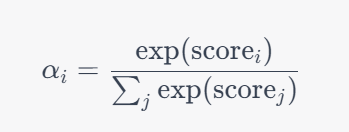
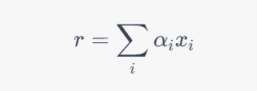

1. Q：pad_sequence 中trailing_dims在什么情况下会起作用

A：`torch.nn.utils.rnn.pad_sequence`函数的`trailing_dims`参数指定了需要沿着填充维度之后要保留的额外维度的数量。在填充的情况下，输入张量的形状将会被扩展一个额外的维度，用于表示填充的数量。这个额外维度后面的维度被称为“尾部维度”。

当你需要在填充维度之后保留输入张量的某些尾部维度时，可以使用`trailing_dims`参数。例如，如果你的输入张量是一个形状为`(batch_size, seq_length, feature_dim)`的三维张量，并且你希望在填充维度之后保留`feature_dim`维度，那么你可以将`trailing_dims`参数设置为`1`，以保留一个额外的维度。

具体来说，当`trailing_dims`为正整数时，`pad_sequence`将在填充维度之后插入一个大小为`trailing_dims`的额外维度。当`trailing_dims`为负整数时，`pad_sequence`将保留输入张量的最后`abs(trailing_dims)`个维度。如果`trailing_dims`为0，`pad_sequence`将不会插入任何额外维度，输出张量将具有形状`(batch_size, max_seq_length, ...)`，其中`max_seq_length`是输入张量的最大序列长度。

2. Q：`torch.tensor(1)`与 `torch.tensor([1])`的区别

A：`torch.tensor(1)` 和 `torch.tensor([1])` 在 PyTorch 中有很大的区别。

`torch.tensor(1)` 创建了一个标量张量（scalar tensor），即只有一个数值的张量，它的形状是一个空张量，因为它不具有任何轴（axes）或维度（dimensions）。

而 `torch.tensor([1])` 创建了一个包含一个元素的张量，形状为 `(1,)`，即一个长度为 1 的一维张量。

这里需要注意的是，当我们使用 Python 内置的数据类型（如整数、浮点数、字符串等）作为 `torch.tensor()` 的输入时，PyTorch 会尝试自动将其转换为张量。在上述例子中，`torch.tensor(1)` 将 Python 整数 1 转换为标量张量，而 `torch.tensor([1])` 将 Python 列表 `[1]` 转换为包含一个元素的张量。

下面是一个示例，用于演示这两个函数的区别：

```python
import torch

# 创建标量张量
a = torch.tensor(1)
print(a)
# 输出：tensor(1)

# 创建一维张量
b = torch.tensor([1])
print(b)
# 输出：tensor([1])
```

 总之，`torch.tensor(1)` 和 `torch.tensor([1])` 返回的张量具有不同的形状和类型，因此在使用时需要注意它们的差异。 

3. Q：self.sx_embedding = nn.Embedding(72, 512, padding_idx=0)，sx_idx.shape=(6*10)请描述进行self.sx_embedding(sx_ids）操作后，维度如何变换

   A：`self.sx_embedding`是一个`nn.Embedding`模块，它将每个输入的索引映射到一个对应的向量表示。它的构造函数的第一个参数是**词汇表的大小**=72，也就是可以嵌入的不同单词或符号的数量为72；第二个参数是每个嵌入向量的维度；第三个参数`padding_idx`指定了哪个索引对应于填充标记（如果存在）。

   当对输入张量`sx_ids`调用`self.sx_embedding(sx_ids)`时，`sx_ids`中的每个元素都被替换为它对应的向量表示，并返回一个形状为`(6, 10, 512)`的张量。

   具体地，假设`sx_ids`的形状是`(6, 10)`，那么`self.sx_embedding(sx_ids)`的操作如下：

   - 将`sx_ids`中的每个整数视为索引，并查找词汇表中该索引对应的向量表示。
   - 将每个向量表示的形状从`(512,)`变为`(1, 512)`，以便它们可以被连接成形状为`(6, 10, 512)`的张量。
   - 将每个索引在词汇表中对应的向量表示连接起来，形成一个形状为`(6, 10, 512)`的张量，即返回值。

   因此，对于`self.sx_embedding(sx_ids)`操作，`sx_ids`的形状`(6, 10)`会变成`(6, 10, 512)`的张量。

   Q：这是不是意味着sx_ids中重复的内容会对应相同的embedding

   A：是的，如果 `sx_ids` 中的两个或多个元素具有相同的值，则它们将对应相同的嵌入向量，因为 `nn.Embedding` 模块根据索引值来查找嵌入向量，如果有多个索引具有相同的值，则它们将引用相同的嵌入向量。这是因为嵌入层的权重是通过训练学习得到的，因此每个嵌入向量的值与它所对应的符号或单词相关联。

   这种情况在自然语言处理中很常见，因为在语言中可能有许多重复的单词，如英文中的冠词和介词，它们在不同的位置上可能具有相同的嵌入向量。在实践中，通过将这些嵌入向量共享，可以显著减少模型的参数数量，从而降低过拟合的风险并提高模型的泛化能力。

   Q：那这样对于一词多义的问题是不是没法解决，如何解决

   A：是的，如果一个单词有多个不同的意思，则它在嵌入层中可能对应多个不同的嵌入向量。这是因为每个嵌入向量都与它所对应的符号或单词相关联，因此在不同的上下文中，同一个单词可能具有不同的含义和嵌入向量。

   解决这个问题的一种方法是使用多义词消歧（Word Sense Disambiguation）技术，它旨在确定一个单词在特定上下文中的正确含义。多义词消歧技术可以通过识别句子中的语法和语义结构、上下文信息以及其他外部知识源（如词典、语料库等）来进行，然后可以将正确的含义与相应的嵌入向量相关联。另外，可以使用上下文嵌入技术，如ELMo和BERT，来捕捉单词在不同上下文中的含义。

   总之，多义词消歧和上下文嵌入技术是解决一词多义问题的两种主要方法，可以用来确定单词在特定上下文中的正确含义，并将相应的嵌入向量与其相关联。

   Q：self-attention是否解决了该问题

   A：在自然语言处理领域中，self-attention机制可以被用来解决一些问题，包括一词多义问题。Self-attention机制可以在一个句子内部建立单词之间的相互作用关系，并将不同的单词分配不同的权重，以反映它们在语句中的重要性。

   通过使用self-attention，可以在句子中为每个单词计算一个上下文相关的表示，这样同一个单词在不同上下文中的嵌入表示将不同。因此，self-attention机制可以帮助解决一词多义问题，因为它能够在不同上下文中为同一个单词生成不同的表示。

   总之，self-attention机制可以用来解决一些自然语言处理问题，其中包括一词多义问题，因为它可以建立单词之间的相互作用关系，并在不同上下文中生成不同的表示。

   Q：那么self-attention将同一单词生成不同表示后，如何查找这些表示，请举例说明

   A：假设我们有一个包含三个单词的句子："The cat sat on the mat."，每个单词都被嵌入到一个512维的向量中。我们想要使用self-attention机制生成一个表示，该表示对于句子分类任务是有意义的。

   我们可以先定义一个查询向量 $q$，其大小为512，然后将其与每个单词向量 $x_i$ 进行点积操作：

   

   这将为每个单词 $i$ 产生一个分数 $\text{score}_i$，表示该单词与查询向量之间的相似度。

   然后，我们将分数经过softmax归一化处理，得到每个单词向量的权重：

   

   接下来，我们将每个单词向量乘以其相应的权重，并对它们进行求和，从而得到一个加权平均向量：

   

   这个加权平均向量 $r$ 就是我们使用self-attention机制生成的表示。

   然后，我们可以将该表示用于句子分类任务，例如使用一个全连接层将其映射到一个类别。如果我们想要生成不同的表示，我们可以使用不同的查询向量 $q$ 来重复上述计算过程，从而得到不同的加权平均向量。

   Q： 所以在self-attention结构下，查询一个句子中某个单词最终的embedding是不是先查传统的embedding表，同时句子中其他的词也必须查表，之后乘Q矩阵计算分数，再根据分数得到注意力权重，最终根据权重乘上$x_i$求和得到最终的嵌入表示？ 

   A：您的理解是基本正确的。在使用self-attention时，每个单词都要先通过一个嵌入层（embedding layer）将其转换为一个固定维度的向量表示（即embedding），这个过程可以看作是查询传统的embedding表。

   然后，每个单词的embedding向量都将分别乘以三个权重矩阵：查询矩阵Q、键矩阵K和值矩阵V，以计算注意力分数。这个分数是单词i与句子中其他所有单词之间的相似度度量，用于指示单词i对其他单词的关注程度。

   根据这些注意力分数，可以计算出单词i与其他单词之间的注意力权重，即哪些单词在当前单词i的上下文中更加重要。最后，对所有单词的embedding向量乘以它们对应的注意力权重，然后加权求和，得到最终的句子表示。具体来说，最终的嵌入表示是将所有加权的embedding向量相加得到的。

   需要注意的是，这个过程中，查询矩阵Q、键矩阵K和值矩阵V都是通过学习得到的，而不是固定的矩阵。这意味着模型可以自动地学习每个单词的上下文信息，并将这些信息编码到它们的嵌入向量中。

   Q： 是不是说每个单词都有对应的Q、K、V矩阵，而不是该单词在每个特定的句子中都对应了不同的Q、K、V矩阵 

   A： 是的，每个单词在模型的参数中都对应着自己的Q、K、V矩阵。在训练过程中，这些参数是被学习和调整的，目的是让模型能够更好地进行语言表示和处理。在推理阶段，输入句子中每个单词对应的Q、K、V矩阵就是在训练过程中学习到的最优参数，这些参数被用来计算该单词的注意力权重以及对应的嵌入表示。因此，无论输入的句子是什么，每个单词在模型中都对应着相同的Q、K、V矩阵，这些矩阵是预训练好的，而不是根据输入句子重新生成的。

   Q：所以相对于原始的只凭借embedding的方法，self-attention只是增加了存储上下文信息的Q、K、V矩阵，只要有足够多的数据量，每个词都能在不同的句子中找到合适的嵌入表示是吗

   A：是的，相对于原始的只使用静态的固定嵌入表示的方法，self-attention结构通过引入Q、K、V矩阵来考虑词与词之间的关系，从而能够更好地捕捉句子中的上下文信息。同时，这些矩阵是在训练过程中学习得到的，因此可以根据数据集中的不同上下文来调整每个单词的表示。在足够大的数据集上，模型可以学习到合适的表示，即使同一个单词出现在不同的句子中，也可以通过不同的Q、K、V矩阵来捕捉其在不同上下文中的含义和作用。

   Q：发挥一下想象力设计更为合适的存储上下文信息的方式，而不是采用Q、K、V的方式 

   A：好的，我来尝试发挥一下想象力。

   一种可能的思路是使用基于图神经网络（Graph Neural Network，GNN）的模型来捕捉上下文信息。具体而言，我们可以将句子中的每个单词看作一个节点，根据它们在句子中的位置连接边，构建一个图结构。然后，我们可以使用GNN对这个图进行处理，得到每个节点的嵌入表示，从而捕捉到每个单词的上下文信息。

   在GNN中，每个节点的嵌入表示可以根据它周围节点的嵌入表示进行更新。具体而言，我们可以定义一个神经网络模型，它将每个节点的嵌入表示和它周围节点的嵌入表示作为输入，输出更新后的节点嵌入表示。这个模型可以类比于卷积神经网络中的卷积层，不过它的输入和输出都是图中节点的嵌入表示。

   我们可以使用类似于自注意力机制中计算注意力权重的方法来计算每个节点的邻居节点的权重。具体而言，我们可以计算每对节点之间的相似度，然后对相似度进行softmax归一化，得到每个节点的邻居节点的权重。然后，我们可以根据权重对邻居节点的嵌入表示进行加权平均，得到每个节点的汇聚嵌入表示。

   最后，我们可以将所有节点的汇聚嵌入表示拼接起来，得到整个句子的嵌入表示。这个嵌入表示可以作为下游任务的输入，例如文本分类或命名实体识别等。

   当然，这只是一种可能的思路，具体的实现还需要进一步的细化和优化。

4. Q： Under the framework of (self)supervised learning, the performance of policy is deeply bounded to offline-data quality and the explicit trade-off between exploitation and exploration no longer exists。 这句话应该怎么解释，用中文回答 可以具体讲讲其中的探索和利用指的是什么嘛，请结合RL中具体的内容。

   A：这句话是指，在自监督学习的框架下，策略的表现严重依赖于离线数据的质量，并且不再存在明确的探索和利用的权衡。

   具体而言，强化学习中的探索和利用指的是在不确定情况下如何权衡选择奖励较高的行动（利用）和尝试新行动以发现更好的行动策略（探索）之间的关系。而在自监督学习中，由于训练数据是由系统自己生成的，因此不存在环境交互，也就无法进行实时的探索和利用的平衡。因此，模型的表现几乎完全取决于训练数据的质量。

   总之，这句话提醒我们，在使用自监督学习进行强化学习时，需要特别注意离线数据的选择和质量，以确保最终的策略表现得尽可能好。

5. Q：为什么SVM训练出的准确率可以被称为准确率上限值

   A：SVM（支持向量机）是一种二元分类模型，其目标是在特征空间中找到一个最优的超平面，将不同类别的样本分开。SVM训练出的准确率可以被称为准确率上限值，因为它具有以下优点：

   1. SVM是一种最大间隔分类器，它尽可能地将不同类别的数据分开。因此，SVM训练出的超平面具有最大的分类间隔，可以最大程度地减少分类误差。
   2. SVM使用核函数将数据映射到高维空间，使得数据在高维空间中更容易分离。这种数据映射可以有效地解决线性不可分问题。
   3. SVM具有良好的泛化能力，能够处理小样本、高维度和非线性问题。在训练集和测试集之间的误差较小，说明SVM训练出的模型具有较好的泛化性能。

   基于以上优点，SVM训练出的准确率可以被称为准确率上限值，即在给定数据集上，SVM模型训练出的准确率是最高的，其他模型的准确率都不可能超过它。

   Q：那么SVM与深度学习相比优劣在哪

   A：SVM和深度学习都是机器学习领域中常用的模型，它们各有优缺点，应用场景也不同。

   优点：

   SVM的优点：

   1. SVM在处理小样本数据时表现出色，能够有效地避免过拟合现象。
   2. SVM适用于高维数据，可以处理线性和非线性数据，而且对于非线性数据，可以使用核方法将其映射到高维空间进行处理。
   3. SVM对噪声数据具有较强的鲁棒性，能够处理数据中的噪声和异常值。

   深度学习的优点：

   1. 深度学习在处理大规模数据时表现出色，能够处理海量数据，提取数据中的高级特征。
   2. 深度学习具有较强的自我学习能力，能够通过不断迭代优化模型，提高模型的准确率。
   3. 深度学习可以处理多种输入类型，如图像、语音、文本等，且能够在不同输入类型之间进行转换。

   缺点：

   SVM的缺点：

   1. SVM在处理大规模数据时较慢，需要较长的训练时间。
   2. SVM对于噪声数据的处理能力虽然较强，但对于数据中的缺失值处理能力较弱。
   3. SVM的模型参数需要人工调节，对于不同的数据集需要调节不同的参数。

   深度学习的缺点：

   1. 深度学习需要大量的计算资源，包括GPU、CPU等，训练时间较长。
   2. 深度学习在处理小样本数据时容易过拟合，需要使用一些技巧来避免过拟合现象。
   3. 深度学习的模型结构较为复杂，不易理解和解释。

   因此，SVM和深度学习各有优缺点，应根据具体的应用场景选择适合的模型。

6. Q：Transformer中的全连接层为什么说是Position-wise
   A： Transformer中的全连接层被称为Position-wise Feedforward Networks，因为这一层的每个神经元都只和输入张量中的同一位置的神经元相连。这意味着，该层对每个位置的特征进行独立的处理，而不考虑其他位置的信息。因此，该层被称为“Position-wise”，因为它在处理每个位置的特征时，只考虑该位置本身的信息，而不考虑其他位置的信息。 

   Q： 如何实现的position-wise 

   A： 在Transformer中，Position-wise全连接层的实现非常简单，它只是一个两层的前馈神经网络。具体来说，它由一个线性变换和一个非线性激活函数组成，其中线性变换对每个位置的特征进行独立的处理。这个线性变换的权重矩阵是共享的，因此可以在所有位置上共享，这使得Position-wise全连接层的计算效率非常高。最后，通过一个ReLU激活函数来引入非线性，以增强模型的表达能力。这种Position-wise的设计使得Transformer能够对每个位置的特征进行独立的处理，从而更好地捕捉序列中不同位置之间的依赖关系。 

   Q：具体说下常规的全连接层和position-wise前馈神经网络的区别

   A：常规的全连接层和Position-wise前馈神经网络的主要区别在于它们的输入和输出。在常规的全连接层中，每个神经元都与输入张量中的所有神经元相连，因此该层的输出是输入张量的全局信息的函数。而在Position-wise前馈神经网络中，每个神经元只与输入张量中的同一位置的神经元相连，因此该层的输出只是输入张量在每个位置上的局部信息的函数。这种设计使得Position-wise前馈神经网络能够更好地处理序列数据，因为它能够对每个位置的特征进行独立的处理，从而更好地捕捉序列中不同位置之间的依赖关系。此外，由于Position-wise前馈神经网络在每个位置上都使用相同的权重矩阵，因此它的计算效率也更高。

   A：在代码上，常规的全连接层和Position-wise前馈神经网络的区别在于它们的输入张量的维度和权重矩阵的形状。常规的全连接层的输入张量是一个二维矩阵，其中第一维表示样本数量，第二维表示每个样本的特征向量。而Position-wise前馈神经网络的输入张量是一个三维张量，其中第一维表示样本数量，第二维表示序列长度，第三维表示每个位置的特征向量。此外，Position-wise前馈神经网络的权重矩阵是一个二维矩阵，其中第一维的大小等于每个位置的特征向量大小，第二维的大小等于输出特征向量大小。在代码实现中，我们可以使用PyTorch或TensorFlow等深度学习框架提供的API来实现这两种网络。

   Q： 给出pytorch实现中代码具体区别 

   A：下面是一个用PyTorch实现常规的全连接层和Position-wise前馈神经网络的示例代码，以便更好地理解它们之间的区别：

   ```python
   import torch
   import torch.nn as nn
   
   # 常规的全连接层
   fc_layer = nn.Linear(in_features=100, out_features=50)
   
   # Position-wise前馈神经网络
   class PositionwiseFeedforward(nn.Module):
       def __init__(self, d_model, d_ff):
           super(PositionwiseFeedforward, self).__init__()
           self.linear1 = nn.Linear(d_model, d_ff)
           self.linear2 = nn.Linear(d_ff, d_model)
           self.relu = nn.ReLU()
   
       def forward(self, x):
           x = self.linear1(x)
           x = self.relu(x)
           x = self.linear2(x)
           return x
   pwffn_layer = PositionwiseFeedforward(d_model=100, d_ff=50)
   ```

   

   在这个示例代码中，我们首先定义了一个常规的全连接层fc_layer，它只包含一个线性变换。然后，我们定义了一个Position-wise前馈神经网络pwffn_layer，它包含两个线性变换和一个ReLU激活函数。这里的输入张量x是一个三维张量，其中第一维表示样本数量，第二维表示序列长度，第三维表示每个位置的特征向量。在forward函数中，我们首先使用第一个线性变换self.linear1对输入张量进行变换，然后使用ReLU激活函数进行非线性变换，最后再使用第二个线性变换self.linear2对张量进行最终的变换，得到Position-wise前馈神经网络的输出。

7. Q：sentence_bleu中的smoothing_function有什么作用？
   A：在计算BLEU分数时，如果使用的是smoothing_function，它将有助于减少罕见单词对整体BLEU分数的负面影响。这是因为smoothing_function通过在分母中添加一个常数来平滑n-gram计数。这种平滑技术有助于确保即使在参考翻译中没有出现的n-gram也能获得一些分数。
   Q：对于序列1：a,b,c,d 序列2：d,c,b,a计算belu

   A：假设n-gram的n取值范围是1到4，使用标准的BLEU计算方法，可以得到以下结果：

   - 对于序列1：a,b,c,d
     - unigram精度 = 1/4
     - bigram精度 = 1/3
     - trigram精度 = 1/2
     - fourgram精度 = 0
   - 对于序列2：d,c,b,a
     - unigram精度 = 1/4
     - bigram精度 = 1/3
     - trigram精度 = 1/2
     - fourgram精度 = 0

   因此，标准BLEU分数为0。

   如果使用smoothing_function，例如加法平滑，可以得到以下结果：

   - 对于序列1：a,b,c,d
     - unigram精度 = (1+1)/(4+4) = 0.25
     - bigram精度 = (1+1)/(3+4) = 0.25
     - trigram精度 = (1+1)/(2+4) = 0.33
     - fourgram精度 = (0+1)/(1+4) = 0.2
   - 对于序列2：d,c,b,a
     - unigram精度 = (1+1)/(4+4) = 0.25
     - bigram精度 = (1+1)/(3+4) = 0.25
     - trigram精度 = (1+1)/(2+4) = 0.33
     - fourgram精度 = (0+1)/(1+4) = 0.2

   因此，使用加法平滑的BLEU分数为0.25。
   Q： bleu = sentence_bleu([imp_sx], denoise_action, smoothing_function=SmoothingFunction().method1) 初始化为以上形式时，将会计算几gram 
   A：使用上述代码初始化的`sentence_bleu`函数将计算1到4元语法（n-gram）的BLEU分数。这是因为默认情况下，`SmoothingFunction().method1`使用1到4元语法的加法平滑。如果需要计算其他n-gram，可以通过指定`weights`参数来指定要使用的n-gram权重。例如，如果要计算仅使用1元语法和2元语法的BLEU分数，可以将`weights`参数设置为`(0.5, 0.5, 0, 0)`。
   Q：最终返回结果与调用的1-4gram计算结果有什么关系
   A：`sentence_bleu`函数返回的最终BLEU分数是基于计算出的1-4gram精度和短语匹配率计算得出的。具体来说，对于n-gram精度，`sentence_bleu`函数计算n-gram的精度得分，然后将其加权平均，其中权重由`weights`参数指定。例如，如果`weights`参数设置为`(0.25, 0.25, 0.25, 0.25)`，则会计算1-4gram的精度得分，并将它们的平均值作为BLEU分数。对于短语匹配率，`sentence_bleu`函数计算候选翻译中与参考翻译匹配的短语数量，并将其除以候选翻译中的总短语数。最终的BLEU分数是n-gram精度和短语匹配率的几何平均值。因此，1-4gram计算结果对最终返回结果有很大的影响。

8. Q：只使用`nn.TransformerEncoder`是否能实现生成任务
   A：`nn.TransformerEncoder`是一个用于自然语言处理的神经网络模型，它可以用于文本分类、机器翻译、问答系统等任务。然而，它本身并不足以实现生成任务，因为生成任务需要在模型内部保持状态并生成一个序列，而`nn.TransformerEncoder`只是将输入序列编码为一个固定长度的向量表示。要实现生成任务，需要将`nn.TransformerEncoder`与其他模型结合使用，例如`nn.TransformerDecoder`或者递归神经网络（`RNN`）。

   Q：We adopt the multi-layer Transformer (Radford et al., 2018) decoder as the recurrent model, which applies a multi-headed self-attention operation over the historical symptom-attribute sequence followed by position-wise feedforward layers to produce an output distribution over target symptoms.这句话中decoder的实现其实是使用的`nn.TransformerEncoder`，这样合理吗？

   A：根据句子中的描述，应该是使用了multi-layer Transformer decoder，而不是`nn.TransformerEncoder`。因为decoder的任务是将历史症状-属性序列映射到目标症状，这需要一个生成模型，而`nn.TransformerEncoder`只能编码输入序列，无法进行生成。因此，使用multi-layer Transformer decoder来实现生成任务是合理的。

   Q：

   ```python
   def forward(self, sx_ids, attr_ids, mask=None, src_key_padding_mask=None):
           if not sx_one_hot and not attr_one_hot:
               inputs = self.sx_embedding(sx_ids) + self.attr_embedding(attr_ids)# sx_embedding返回的维度
           else:
               inputs = torch.cat([self.sx_embedding(sx_ids), self.attr_embedding(attr_ids)], dim=-1)
           if dec_add_pos:
               inputs = self.pos_embedding(inputs)
           outputs = self.decoder(inputs, mask, src_key_padding_mask)# src_key_padding_mask传递给了encoder_layer forward中的self_attn，描述了哪些位置是padding
           return outputs
   #以上是推理阶段其forward代码，下面是其中self.decoder的代码
   self.decoder = nn.TransformerEncoder(
               encoder_layer=nn.TransformerEncoderLayer(
                   d_model=emb_dim,
                   nhead=dec_num_heads,
                   dim_feedforward=dec_dim_feedforward,
                   dropout=dec_dropout,
                   activation='relu'),
               num_layers=dec_num_layers)
   ```

   A：根据给出的代码，`self.decoder`是一个`nn.TransformerEncoder`，而不是`nn.TransformerDecoder`。这里使用的是Encoder而不是Decoder，因为在给定历史症状-属性序列的情况下，需要将其编码为一个固定长度的向量表示，然后用于生成目标症状。而Decoder则是用于生成序列的模型，通常需要在内部保持状态并逐步生成每个单词。因此，在这个任务中使用Encoder是合理的。

   Q： 下面是decoder网络具体的初始化内容： 

   ```python
   def __init__(self, sx_embedding, attr_embedding, pos_embedding, num_sxs: int, emb_dim: int):
           super().__init__()
   
           self.num_sxs = num_sxs
   
           self.sx_embedding = sx_embedding
           self.attr_embedding = attr_embedding
           self.pos_embedding = pos_embedding
   
           self.decoder = nn.TransformerEncoder(
               encoder_layer=nn.TransformerEncoderLayer(
                   d_model=emb_dim,
                   nhead=dec_num_heads,
                   dim_feedforward=dec_dim_feedforward,
                   dropout=dec_dropout,
                   activation='relu'),
               num_layers=dec_num_layers)
   
           self.sx_fc = nn.Linear(emb_dim, num_sxs)
   ```

   A：根据给出的代码，这是一个基于`nn.TransformerEncoder`的生成模型。模型的输入包括历史症状序列和属性序列，它们被分别嵌入为向量表示，并进行拼接。然后，这个向量序列被送入一个`nn.TransformerEncoder`中，使用多个encoder_layer进行编码。最终的输出是一个固定长度的向量表示，它被送入一个全连接层（`nn.Linear`）中，用于预测目标症状。因此，这个模型是一个基于Transformer的生成模型，用于将历史症状-属性序列映射到目标症状。

   Q：该架构是否是Encoder-Linear的一个生成式架构

   A：是的，这个架构可以看作是一个Encoder-Linear的生成式架构。Encoder部分使用了`nn.TransformerEncoder`对历史症状-属性序列进行编码，然后将编码后的向量作为输入送入全连接层（`nn.Linear`）中，用于预测目标症状。由于只使用了一个全连接层，因此可以将这个模型看作是一个线性生成模型。

9. Q：model.train()和model.eval()作用是什么

   A：在PyTorch中，`model.train()`和`model.eval()`方法是用于设置模型的训练状态和评估状态的方法。

   `model.train()`方法用于将模型设置为训练状态，这意味着模型会启用一些特定于训练的功能，例如Dropout和Batch Normalization。在训练过程中，我们需要使用这些功能来防止模型过度拟合，并提高模型的泛化能力。因此，在每次进行训练之前，我们需要将模型设置为训练状态，以便在训练过程中正确地使用这些功能。

   `model.eval()`方法用于将模型设置为评估状态，这意味着模型会禁用一些特定于训练的功能，例如Dropout和Batch Normalization。在评估过程中，我们需要对模型进行测试，并获得其在测试数据集上的性能指标。由于我们不希望在测试过程中使用Dropout和Batch Normalization等功能，因此我们需要将模型设置为评估状态。

   需要注意的是，在使用`model.eval()`方法之前，通常需要先调用`torch.no_grad()`方法来禁用自动求导功能，以避免在评估过程中计算不必要的梯度信息。

10. Q： Because the proposed architecture, in a sense, imitates the logic of decision-making by physicians in real life (additional cyclic tests until the diagnosis is certain), the proposed framework can be considered as one of the variants of logic regularization 为什么模拟了医生的决策就可以称为是逻辑正则化的变体 

    A：逻辑正则化是一种用于提高机器学习模型可解释性和泛化性能的技术，其主要思想是通过约束模型的决策逻辑来避免过拟合和提高泛化性能。而在上述文本中，提到的模型架构通过模拟医生的决策过程，引入了额外的循环测试，直到诊断结果确定，这种设计与逻辑正则化的思想是相似的。

    具体来说，医生在诊断病人时，通常会进行多次测试和观察，直到确定诊断结果。这种决策逻辑可以被视为一种规则或约束，即在进行诊断时需要遵循某种逻辑流程。而模拟这种决策逻辑，可以看作是对模型进行了一定的约束和规范，从而避免了过拟合和提高了泛化性能。因此，可以将这种模拟医生决策的模型架构视为逻辑正则化的一种变体。

    总之，因为模拟了医生的决策过程，并引入了额外的循环测试来确定诊断结果，所以可以将该模型架构视为逻辑正则化的一种变体。

11. 

12. 

13. 

14. 


 