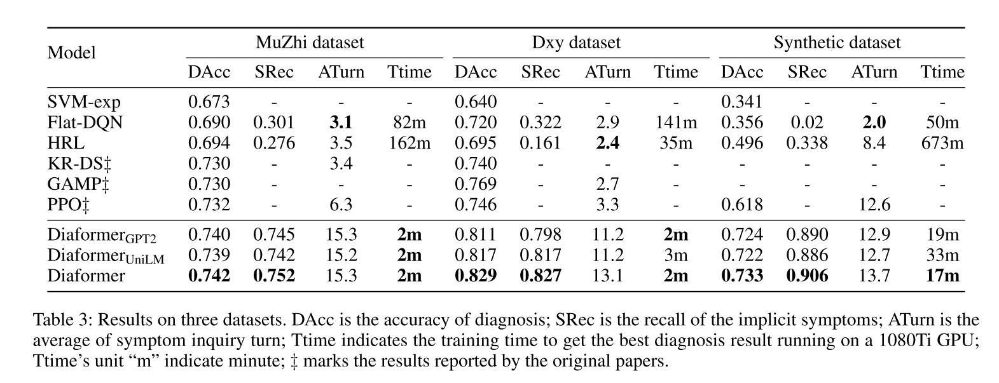
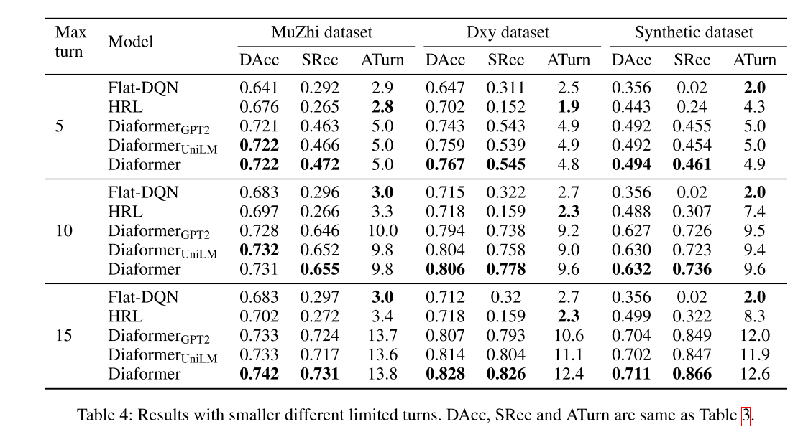
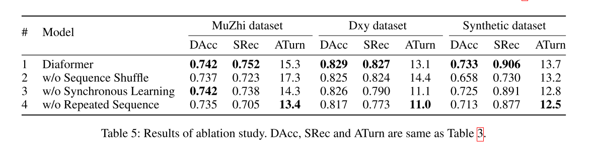

# 实验记录

### Baselines

#### DxFormer

##### 论文中实验结果

##### 模型参数设置

- DxFormer is composed of a **4-layer decoder** and a **1-layer encoder**. 

- Dxy, the embedding and hidden size is set to 128, and feedforward size is set to 256. 
- MZ-4 and MZ-10, the embedding and hidden size is set to 512, and feed-forward size is set to 1024. 
- We use Adam optimizer (Kingma and Ba, 2014) with a learning rate of 3e-4 for <u>maximum-likelihood pre-training</u>, and learning rate of 1e-4 for <u>RL training</u>. All our experiments are performed on 4 Nvidia Tesla V100 32G GPUs. Following the conventional setting, all baseline models as well as our DxFormer specify the maximum number of turns for symptom inquiry to **10** **during inference**, the threshold  is set to 0.99. It is worth noting that **during training**, the maximum number of turns of DxFormer is set to **40**

#### DiaFormer

##### 论文中实验结果

#### NeuralSympCheck

##### 论文中实验结果

